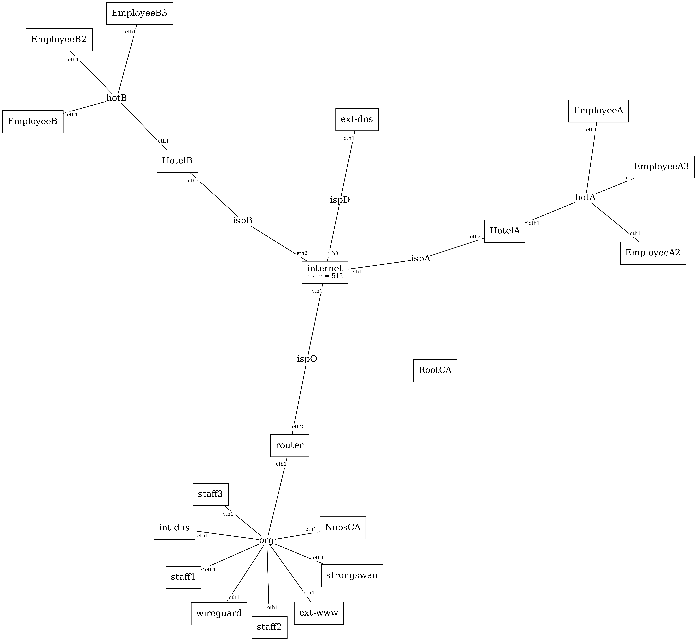
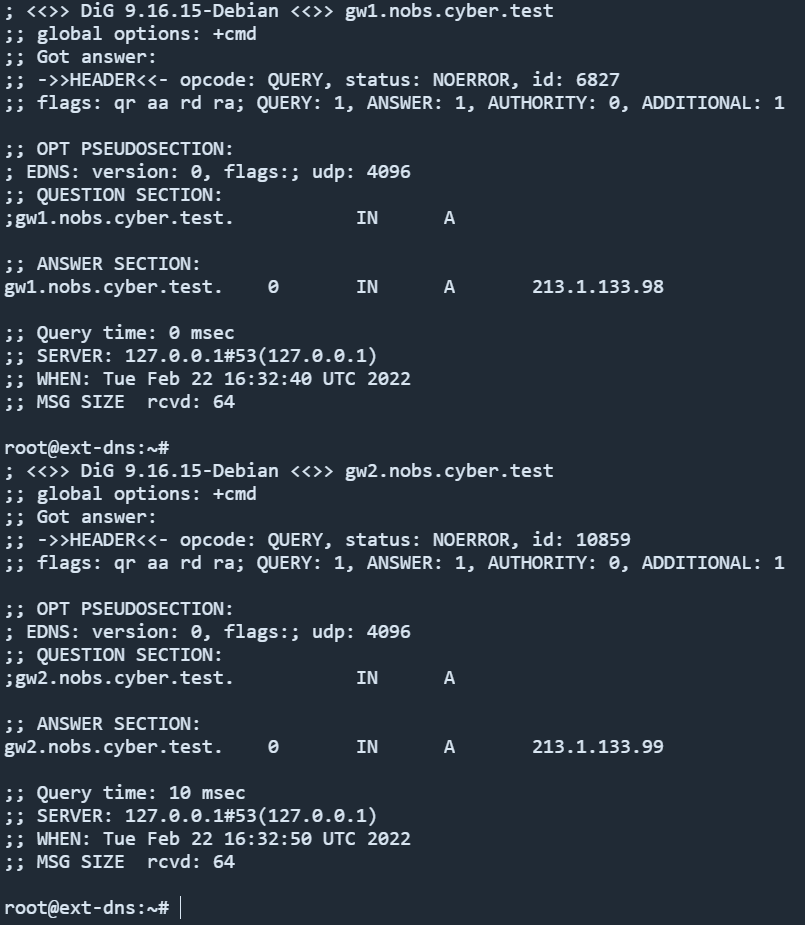
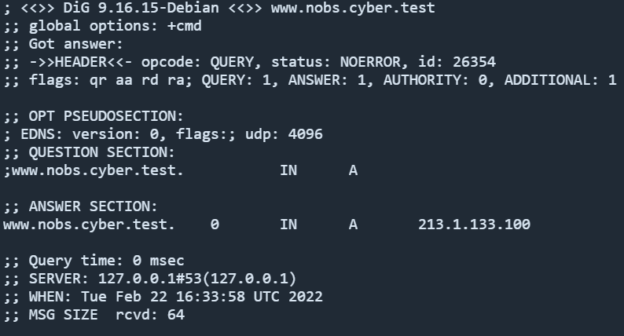
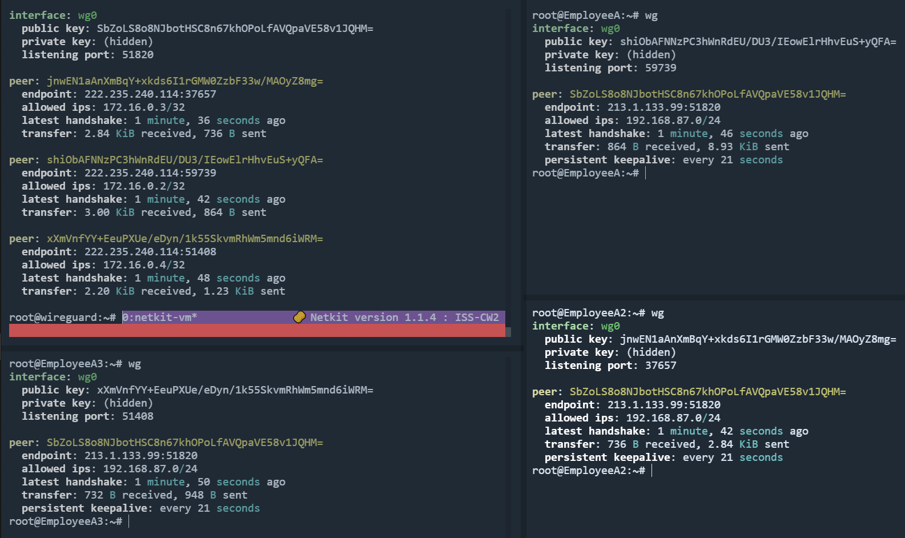
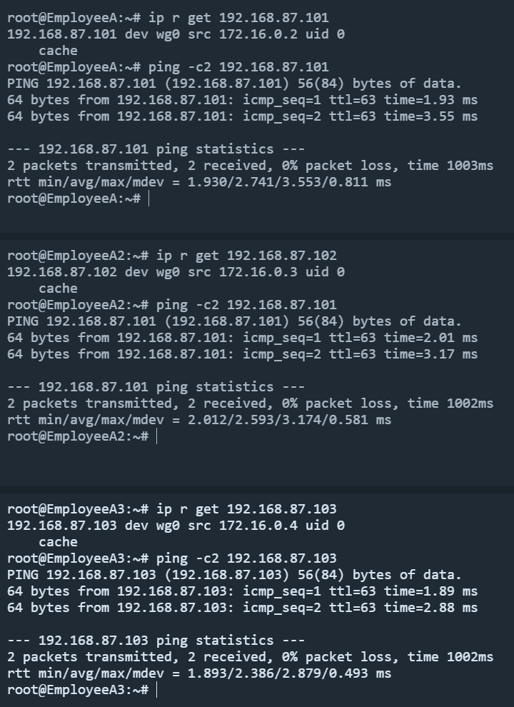
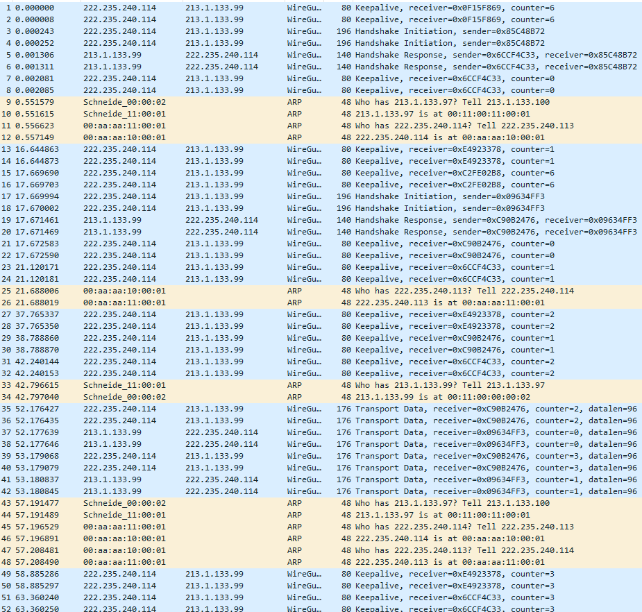
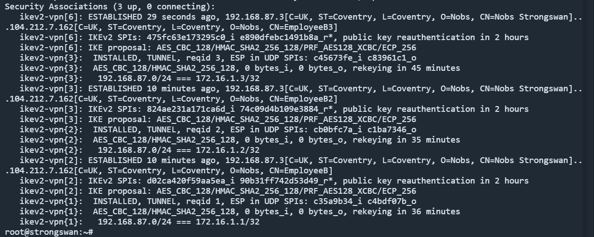
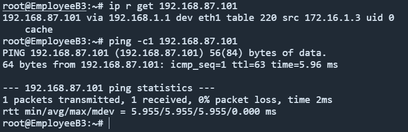
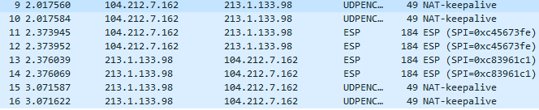

# ISS CW2 - Group nobs

### **Members:**
- Nathan Chamberlain - *u2043025* - `3D7CD14D03DA7867FB097434C332ADB38F4300BC`
- Oscar Cornish - *u2053390* - `AE4D5827E507CCD6BC12051B1202F8B8CBD803A0`
- Ben Smith - *u2027437* - `C7DFCEEDD43774D05F6FF812205C19426EFBFDD8`

## **Table of contents:**
##### *Number after refers to the point in the brief*

- [Network diagram](#network-diagram)
- [x509 Certificate hierarchy *(2)*](#x509-certificate-hierarchy)
- [IP Addresses and DNS Records *(8)*](#ip-addresses-and-dns-records)
- [VPN Implementation *(6, 10, 11, 15)*](#vpn-implementation)
- [Creating the certificates](#creating-the-certificates)

### **Network diagram:**



- HotelA has three Wireguard clients _(EmployeeA, EmployeeA2, EmployeeA3)_
- HotelB has three Strongswan clients _(EmployeeB, EmployeeB2, EmployeeB3)_

***

## **x509 Certificate hierarchy:**

### *Certificate structure:*

- RootCA
    - NobsCA
        - Strongswan vpn cert
        - EmployeeB  cert
        - EmployeeB2 cert
        - EmployeeB3 cert
        - www.nobs.cyber.test cert

### *Justification:*

I decided to go for a structure with a depth of 3 for simplicity, while still demonstrating a realistic scenario. The root certificate authority (`RootCA`) is an offline machine to limit exposure, It has a cert on it that is signed by itself that it uses to sign the certificates of the layer below, in our implementation it is just the `NobsCA` but in reality there would be many more.

The `NobsCA` is refered to as a subordinate CA (As it is signed by another CA) in this scenario the organisation has control over their own CA but it is signed by a public `RootCA` (I'm not sure if this really happens in th real world, I couldn't find anything to suggest it would or would not) therefore they can issue certificates without having to get the Certificate Authority to sign their request, thus they can easily issue and revoke certificates for roadwarrior employees.

Another benefit to the `NobsCA` being signed by the `RootCA` is that (Assuming `RootCA` is deemed a 'trust anchor' by their device) they will implicitly trust the certs issued by `NobsCA`, including the one for the https webserver, avoiding the untrusted warning they would otherwise get.

## **IP addresses and DNS Records:**

External DNS records point to the gateways and the webserver:




This means the webserver can be accessed externally:


## **VPN Implementation:**

### *Wireguard:*

All three wireguard clients can connect to the vpn simultaneously:



These clients can ping the internal network via the wg0 interface:



The traffic between these is encrypted, and the contents cannot be seen by somebody sniffing packets:



### *Strongswan:*

The strongswan clients can also all connect at the same time:



This allows the remote employees to ping the internal network, note that unlike wireguard that uses a network device `wg0` strongswan instead uses policy based routing, on table 220:



Packet sniffers cannot see the content or type of traffic:



### *VPN Comparison:*

Wireguard (wg) VPN Clients have the downside that they use a pre-shared key, at some point wg clients must exchange public keys with the server, wg itself has no key exchange ability, additionaly the roadwarrior users must have static IP addresses which can cause the configuration to become bloated with large numbers of clients.

The advantage to Wireguard is that it is simpler to setup, it does not require the implementation of x509 certificates and has a relatively simple configuration, this makes it a very suitable VPN choice for small organistaions with limited infrastructure and limited roadwarrrior clients.

Strongswan (ss) on the other hand uses x509 certificates for authentication (in our implementation), this requires some infrastructure to exist - although it should be noted that a lightweight private CA is not as hard to manage and setup. The configuration for strongswan is much more extensive, and thus harder to setup, although this extended configuration does allow for more flexible use of the VPN.

Strongswans greatest advantage over wireguard is that IP addresses are dynamically assigned to remote users, this means they can all share the same config and also do not require any setup on the server side (wireguard clients must be predefined on the server side), this gives the organisation the ability to quickly and simply add new remote clients, all they need is a certificate signed by the `NobsCA`.

## **Building the x509 Certificate structure:**

## Structure:

---

```
                                                        ┌─────────┐
                                                        │         │
                                           ┌────────────┤ Devices │
                ┌─────────┐                │            │         │
                │         │                │            └─────────┘
                │ Root CA │◄───────────────┘
                │         │        Trusts
                └────┬────┘
                     │
                     │   Signs
        Public       │
       ─ ─ ─ ─ ─ ─ ─ ├─ ─ ─ ─ ─ ─ ─
        Private      │
                     │
                     │
                     │
                     ▼
             ┌────────────────┐
             │                │
        ┌────┤ Subordinate CA ├───┐
        │    │                │   │
  Signs │    └────────────────┘   │   Signs
        │                         │
        │                         │
        ▼                         ▼
┌────────────────┐        ┌──────────┐
│                │        │          │
│ Webserver Cert │        │ VPN Cert │
│                │        │          │
└────────────────┘        └──────────┘
```
The benefits to using a subordinate CA is that the organisation can issue and revoke new certificates quickly and easily, they do not rely on the 

## Creating the certificates:

---

> *An issue I ran into here was that I used a small key for all of this, merely to save time when they are created - unfortunately apache does not like a key of this size as it is insecure, therefore to set up https we'd have to increase the key size from the root down to atleast 2048 bits.*

### Root CA: (`RootCA/cert_script.sh`)

This script creates a simple directory structure, then creates the private key and cert.

> The RootCA machine sits offline, certificate requests to be signed are taken to it via removable media, this air-gap is a good way of keeping it safe.

we generate the certificate with numerous flags:

- *-newkey rsa:1024* : Create a new key for this certificate (1024 bits is low for a root CA, this is for demonstration only)
- *-nodes* : Do not encrypt the output key (again, just for simplification)
- *-x509* : output x509 certificate (self-signed)
- *-days 3650* : Certificate is valid for 10 years (almost...)

Then make the key read only (to our user) since we dont intend on changing the file.

Then just verify that the key is valid.

The line:
"`keyUsage             = critical, digitalSignature, cRLSign, keyCertSign`"
Allows this certficate to later sign other certificates, and also revoke certificates, this is important functionality for a RootCA

```sh
## Create and verify root certificates

# Prep directories
mkdir -p x509/private
mkdir -p x509/certs
chmod 700 x509/private

# Write to config
cat > "openssl.cnf" << EOF
distinguished_name = req_distinguished_name
req_extensions = v3_req

[req_distinguished_name]
C  = UK

[v3_req]
basicConstraints     = critical, CA:TRUE
subjectKeyIdentifier = hash
keyUsage             = critical, digitalSignature, cRLSign, keyCertSign
EOF

# Create cert + key
openssl req \
	-newkey rsa:1024 -nodes -keyout x509/private/RootCA.key \
	-subj "/C=UK/ST=Coventry/L=Coventry/O=Nobs Root CA/CN=(Untrustworthy) Example Certificate Authority" \
    -extensions v3_req \
	-sha256 -x509 -days 3650 -config "openssl.cnf" -out x509/certs/RootCA_Cert.crt

# Make key read only
chmod 400 x509/private/RootCA.key

# Verify key
openssl x509 -noout -text -in x509/certs/RootCA_Cert.crt

```
---
### Subordinate Certificate Request: (`NobsCA/create_csr.sh`)

Works in the same way as the previous example, except this time dropping the *-x509* tag, since we would like a certificate request instead of a self-signed certificate.

The config here will mean that the CSR contains the usages we have given, however these have to be specified when the CSR is signed still - I have left them here as a way of indicating to the RootCA what usages are desired.

```sh
## Create a certificate request for the NOBS subordinate CA

# Prep dirs
mkdir -p x509/private
mkdir x509/certs
mkdir x509/unsigned

chmod 700 x509/private

cat > "openssl.cnf" << EOF
distinguished_name = req_distinguished_name
req_extensions = v3_req

[req_distinguished_name]
C  = UK

[ v3_req ]
basicConstraints        = critical, CA:TRUE, pathlen:1
subjectKeyIdentifier    = hash
keyUsage                = critical, cRLSign, digitalSignature, keyCertSign
EOF

# Create certificate signing request + key
openssl req \
        -newkey rsa:1024 -nodes -keyout x509/private/nobsCA.key \
        -subj "/C=UK/ST=Coventry/L=Coventry/O=Nobs/CN=Nobs Subordinate CA" \
        -config "openssl.cnf" -extensions v3_req \
        -sha256 -out x509/unsigned/nobsCA.csr

# Make key read only
chmod 400 x509/private/nobsCA.key
```
---
### Signing the Subordinate Certificate Request: (`RootCA/sign_intermediate.sh`)

> Prior to running this script the `NobsCA.csr` on the IntermediateCA machine should be transfered to the `RootCA/x509/NobsCA.csr`

Here we see some new flags:
- *-CAcreateserial* : Creates a serial number file if one doesn't already exist (this is used to keep track of which certificates have been issued and to who).
- *-days 1825* : Approx 5 years, could be anything but certificate will be      invalidated when the root expires.

```sh
## Script for signing the nobs CAs CSR (saved under nobsCA.csr)

cat > "openssl.cnf" << EOF
distinguished_name = req_distinguished_name
req_extensions = v3_req

[req_distinguished_name]
C  = UK

[ v3_req ]
basicConstraints        = critical, CA:TRUE, pathlen:1
subjectKeyIdentifier    = hash
keyUsage                = critical, cRLSign, digitalSignature, keyCertSign
EOF

# Sign the subordinate csr signed by root
openssl x509 -req \
	-CA x509/certs/RootCA_Cert.crt -CAkey x509/private/RootCA.key \
	-CAcreateserial -days 1825 -sha256 \
	-extfile "openssl.cnf" -extensions v3_req \
	-in nobsCA.csr -out nobsCA.crt

# Verify subordinate cert
openssl x509 -noout -text -in nobsCA.crt

# Verify against root cert
openssl verify -CAfile x509/certs/RootCA_Cert.crt nobsCA.crt

# Return cert to nobsCA
```
Now the certificate (`NobsCA.crt`) can be returned to the IntermediateCA machine for use.

***
### Signing the end certificates (`strongswan/create_ss_csr.sh`):

Most of the end certificates are almost carbon copies of one another so I will only show one here, the others are made in exactly the same process.

Firstly the endpoint (We will use strongswan in this case) has to create a CSR for the usages desired:

The difference is that:
- `basicContraints = CA:FALSE` : Means it cannot be sign more certificates
- `extendedKeyUsage = clientAuth, serverAuth`: Used for server or client side authentication
- The alt names are define the SAN, these are the names that the server may have, in this case it is just the FQDN and IP address.

Again these are merely indications to the CA about what we would like the cert to have, the CA has end choice.

```sh
# Prep dirs
# Strong swan has specific dirs to use
mkdir -p etc/ipsec.d/private
mkdir etc/ipsec.d/certs
chmod 700 etc/ipsec.d/private

# Write to config
cat > "openssl.cnf" << EOF
distinguished_name = req_distinguished_name
req_extensions = v3_req

[req_distinguished_name]
C  = UK
ST = Coventry
L  = Coventry
O  = Nobs
CN = Nobs Strongswan

[v3_req]
basicConstraints     = CA:FALSE
subjectKeyIdentifier = hash
keyUsage             = digitalSignature, keyEncipherment
extendedKeyUsage     = clientAuth, serverAuth
subjectAltName       = @alt_names

[alt_names]
IP.1  = 213.1.133.98
DNS.1 = gw1.nobs.cyber.test
EOF

# Make CSR + key
openssl req \
        -newkey rsa:1024 -nodes -keyout etc/ipsec.d/private/strongswan.key \
        -subj "/C=UK/ST=Coventry/L=Coventry/O=Nobs/CN=Nobs Strongswan" \
        -config "openssl.cnf" -extensions v3_req \
        -sha256 -out strongswan.csr

chmod 400 etc/ipsec.d/private/strongswan.key

# Send to subordinate CA for signing
```

Then we sign the CSR on the subordinate CA, with the attributes it requested:

```sh
## Script to sign strongswan csr, located at `/unsigned/strongswan.csr`

mkdir signed

# Write to config (Important part here is the alt_names)
cat > "openssl.cnf" << EOF
[v3_req]
basicConstraints     = CA:FALSE
subjectKeyIdentifier = hash
keyUsage             = digitalSignature, keyEncipherment
extendedKeyUsage     = clientAuth, serverAuth
subjectAltName       = @alt_names

# Alternative names are specified as IP.# and DNS.# for IP addresses and
# DNS accordingly. 
[alt_names]
IP.1  = 213.1.133.98
DNS.1 = gw1.nobs.cyber.test
EOF

# Sign CSR using the above config for the alt_names
openssl x509 -req \
        -in "unsigned/strongswan.csr" \
        -CA "x509/certs/nobsCA.crt" \
        -CAkey "x509/private/nobsCA.key" \
        -CAcreateserial -days 365 \
        -extensions v3_req \
        -extfile "openssl.cnf" \
        -out "signed/strongswan.crt"
    

# Verify cert
openssl x509 -noout -text -in signed/strongswan.crt

# Send back to strongswan machine

```

This can be sent back to the strongswan machine for use.